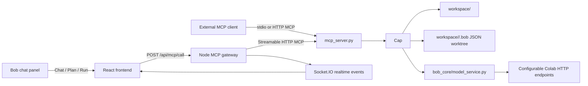

# Bob IDE Colab + MCP Handoff

This document is the compatibility contract for wiring the Colab notebook to
Bob IDE. The IDE now routes command behavior through a shared capability
registry, exposes those capabilities through Node and MCP, tracks source changes
in a JSON-backed worktree, and treats model output as reviewable proposals.

## Runtime Shape



Socket.IO remains the realtime data plane for terminal output, editor changes,
workspace refreshes, worktree refreshes, and model run status. Node and MCP are
the command plane.

## Important Rule

The model must never write project files directly. Colab returns a plan, code,
review, and generated file map. Bob IDE stores those generated files as
`proposed` worktree changes. The user can inspect diffs, discard proposals, or
apply them. Applying a proposal writes the file and turns it into an unstaged
manual change.

## Colab Configuration

The Python MCP service reads these environment variables:

| Variable | Default | Purpose |
| --- | --- | --- |
| `BOB_COLAB_BASE_URL` | empty | Base URL for the Colab HTTP app. If empty, Bob uses a local contract stub. |
| `BOB_COLAB_PLAN_PATH` | `/plan` | Planner-only endpoint path. |
| `BOB_COLAB_RUN_PATH` | `/run-agent` | Full planner -> coder -> reviewer endpoint path. |
| `BOB_COLAB_TIMEOUT` | `600` | HTTP timeout in seconds. |
| `BOB_COLAB_TOKEN` | empty | Optional bearer token. |
| `BOB_COLAB_HEADERS_JSON` | `{}` | Optional extra HTTP headers as JSON. |

Example:

```powershell
$env:BOB_COLAB_BASE_URL="https://your-ngrok-or-colab-url"
$env:BOB_COLAB_PLAN_PATH="/plan"
$env:BOB_COLAB_RUN_PATH="/run-agent"
$env:BOB_COLAB_TOKEN="optional-secret"
```

## Request Payload Sent To Colab

Both planner and full-agent calls receive one JSON object:

```json
{
  "run_id": "run_000001",
  "project": "sample_project",
  "user_prompt": "User request text",
  "active_path": "optional/current/file.py",
  "workspace_tree": {
    "name": "sample_project",
    "path": "",
    "type": "workspace",
    "children": []
  },
  "files": {
    "path/to/file.py": "full file contents"
  }
}
```

`files` is capped by the backend at about 500 KB total context. The active file
is placed first when available.

## Planner Endpoint Response

`POST {BOB_COLAB_BASE_URL}{BOB_COLAB_PLAN_PATH}` should return either the plan
object directly or `{ "plan": <plan> }`.

The normalized plan shape is:

```json
{
  "task_type": "bugfix | feature | refactor | docs | investigation",
  "summary": "Short user-facing plan summary",
  "confidence": 0.75,
  "output_mode": "request_workspace | request_files | request_docs | ready_for_coder",
  "need_workspace_scan": false,
  "need_file_contents": false,
  "need_documentation": false,
  "investigation_points": [],
  "possible_causes": [],
  "required_context": [],
  "files_needed": [],
  "documentation_needed": [],
  "tool_calls": [],
  "reasoning_steps": [],
  "coder_prompt": "Prompt to pass to coder"
}
```

Missing keys are filled with defaults by Bob IDE, but Colab should return the
full shape to avoid ambiguity.

## Full Agent Endpoint Response

`POST {BOB_COLAB_BASE_URL}{BOB_COLAB_RUN_PATH}` should return:

```json
{
  "run_id": "run_000001",
  "provider": "colab-qwen",
  "plan": {},
  "code": "Raw coder markdown output",
  "review": "PASS\nShort reviewer explanation",
  "final_status": "PASS",
  "files": {
    "path/to/file.py": "full replacement contents"
  },
  "metadata": {
    "model": "Qwen/Qwen2.5-7B-Instruct",
    "max_iterations": 5
  }
}
```

Compatibility behavior:

- `final_status` must be `PASS` or `FAIL`.
- If `final_status` is absent, Bob infers it from whether `review` starts with
  `PASS`.
- If `files` is absent or not an object, Bob parses `code`.
- `files` values must be full file contents, not patches.
- Use `null` as a file value only when intentionally proposing deletion.
- A `FAIL` review is stored and shown, but normal Apply is blocked. The user can
  explicitly override and apply from Source Control.

## Coder Markdown Fallback Format

If Colab returns only `code`, Bob parses files from markdown blocks compatible
with the notebook parser:

````markdown
### `frontend/src/App.jsx`
```jsx
export default function App() {
  return <div>Hello</div>;
}
```

FILE: bob_core/example.py
```python
print("hello")
```
````

When a code block has no path, Bob assigns it to the next `plan.files_needed`
entry. If no expected file is available, it uses a generic name based on the
language.

## Async Run Lifecycle

`model.plan` and `model.run_agent` return immediately with a persisted run:

```json
{
  "run_id": "run_000001",
  "status": "queued",
  "mode": "plan"
}
```

The backend then runs work on a background thread and emits Socket.IO
`model:run` events to `workspace:<project>`:

| Status | Meaning |
| --- | --- |
| `planning` | Context was built and Colab planner is being called. |
| `coding` | Full-agent response included a plan and coding output is being processed. |
| `reviewing` | Review status and generated file set are being recorded. |
| `completed` | Run finished. Proposals may have been created. |
| `failed` | The call or normalization failed. The run record includes `error`. |

Bob chat displays the structured plan, review, final status, linked proposal
files, and errors.

## JSON Worktree Files

Each workspace gets a hidden `.bob` folder:

```text
.bob/
  index.json
  snapshots.json
  snapshots/snapshot_000001.json
  changes.json
  staged.json
  runs.json
  model_runs.json
  patches/patch_000001.patch
  change_blobs/change_000001_before.txt
  change_blobs/change_000001_after.txt
```

The Explorer and model context skip `.bob`.

### Change States

| State | Meaning |
| --- | --- |
| `unstaged` | Real file differs from the current baseline. |
| `staged` | User staged an unstaged change for checkpointing. |
| `proposed` | Bob model output exists but has not touched files. |
| `conflict` | Proposal base hash differs from the current file. |
| `discarded` | Change/proposal was discarded. |
| `checkpointed` | Staged change was included in a snapshot checkpoint. |

## Backend Worktree Functions

Defined in `bob_core/json_worktree.py`:

| Function | Purpose |
| --- | --- |
| `init_worktree(project)` | Creates `.bob` metadata and initial baseline snapshot. |
| `detect_manual_changes(project)` | Compares visible workspace files against the latest snapshot and records active changes. |
| `record_manual_change(project, path)` | Creates or updates one unstaged manual change after a file write/create/delete. |
| `record_rename(project, old_path, new_path)` | Records rename as delete + add relative to baseline. |
| `record_model_proposal(project, run_id, files, review_status)` | Stores Colab-generated files as proposed changes with before/after blobs. |
| `get_status(project)` | Returns grouped `proposed`, `changes`, `staged`, and `conflicts`. |
| `get_diff(project, change_id)` | Returns metadata, before content, after content, and unified diff. |
| `stage_change(project, change_id)` | Moves an unstaged change to staged. |
| `unstage_change(project, change_id)` | Moves a staged change back to unstaged. |
| `stage_all(project)` | Stages all unstaged changes. |
| `unstage_all(project)` | Unstages all staged changes. |
| `apply_change(project, change_id, override=False)` | Applies a proposed/conflicted model change to disk if review/hash checks pass. |
| `apply_all(project, override=False)` | Applies all proposed/conflicted changes and returns errors per change. |
| `discard_change(project, change_id)` | Discards a proposal or restores a manual change from baseline. |
| `discard_all(project)` | Discards all active groups. |
| `create_snapshot(project, label=None)` | Checkpoints staged changes and advances the baseline. |
| `get_history(project)` | Returns snapshots and runs. |
| `get_file_history(project, path)` | Returns all change records for one file. |
| `create_run(project, prompt, mode)` | Persists a queued planner/agent run. |
| `update_run(project, run_id, **updates)` | Updates run status/results. |
| `get_run(project, run_id)` | Reads one run record. |
| `record_model_stage(project, run_id, stage, output)` | Appends raw planner/coder/reviewer output. |

## MCP Capabilities

All capabilities are callable through:

- REST gateway: `POST /api/mcp/call` with `{ "name": "...", "arguments": {} }`
- MCP server: `python mcp_server.py`
- Compatibility REST routes in `routes/api.py`

| Capability | Arguments | Returns / Side Effects |
| --- | --- | --- |
| `system.status` | none | Service status and realtime planes. |
| `workspace.list` | none | Workspace names. |
| `workspace.create` | `name` | Creates starter workspace and initializes worktree. |
| `workspace.import` | `name`, `files`, `folders` | Imports browser folder content and initializes worktree. |
| `workspace.tree` | `project` | Visible file tree. |
| `file.read` | `project`, `path` | Editable text file content. |
| `file.write` | `project`, `path`, `content` | Writes file, records manual change, emits realtime events. |
| `file.create` | `project`, `path` | Creates empty file, records manual change. |
| `file.delete` | `project`, `path` | Deletes file/folder, records manual changes. |
| `file.rename` | `project`, `path`, `new_path` | Renames file/folder, records delete/add changes. |
| `folder.create` | `project`, `path` | Creates a folder. |
| `code.validate` | `path`, `content` | Python/JSON validation problems. |
| `code.search` | `project`, `query` | Workspace text search matches. |
| `code.run_python` | `project`, `path`, `timeout` | Captured Python run output. |
| `terminal.execute` | `project`, `command`, `timeout` | Non-interactive shell result. |
| `test.pytest` | `project` | Pytest counts and output. |
| `assistant.chat` | `message`, `active_path` | Placeholder chat response until a model is connected. |
| `worktree.init` | `project` | Initializes `.bob`. |
| `worktree.status` | `project` | Detects manual changes and returns grouped status. |
| `worktree.get_diff` | `project`, `change_id` | Before/after content and unified diff. |
| `worktree.stage_change` | `project`, `change_id` | Stages one unstaged change. |
| `worktree.unstage_change` | `project`, `change_id` | Unstages one staged change. |
| `worktree.stage_all` | `project` | Stages all manual changes. |
| `worktree.unstage_all` | `project` | Unstages all staged changes. |
| `worktree.apply_change` | `project`, `change_id` | Applies one passing proposal if hash checks pass. |
| `worktree.override_and_apply` | `project`, `change_id` | Applies a failed/conflicted proposal with explicit override. |
| `worktree.apply_all` | `project`, `override` | Applies all proposals/conflicts, collecting errors. |
| `worktree.discard_change` | `project`, `change_id` | Discards proposal or restores manual change. |
| `worktree.discard_all` | `project` | Discards all active changes. |
| `worktree.create_snapshot` | `project`, `label` | Checkpoints staged changes and advances baseline. |
| `worktree.history` | `project` | Snapshot and run history. |
| `worktree.file_history` | `project`, `path` | Change history for one file. |
| `model.plan` | `project`, `prompt`, `active_path` | Starts async planner-only Colab call. |
| `model.run_agent` | `project`, `prompt`, `active_path` | Starts async full Colab pipeline. |
| `model.run_status` | `project`, `run_id` | Reads persisted run status. |

## Compatibility REST Routes

The frontend uses `/api/mcp/call`, but these compatibility routes still exist:

| Route | Capability |
| --- | --- |
| `GET /api/mcp/tools` | Lists capabilities. |
| `POST /api/mcp/call` | Invokes any capability. |
| `GET /api/worktree/status` | `worktree.status` |
| `GET /api/worktree/diff` | `worktree.get_diff` |
| `POST /api/worktree/stage` | `worktree.stage_change` |
| `POST /api/worktree/unstage` | `worktree.unstage_change` |
| `POST /api/worktree/apply` | `worktree.apply_change` |
| `POST /api/worktree/discard` | `worktree.discard_change` |
| `POST /api/worktree/snapshot` | `worktree.create_snapshot` |
| `GET /api/worktree/history` | `worktree.history` |
| `POST /api/bob/run-agent` | `model.run_agent` |

## Frontend Behavior

- Activity Bar includes Source Control with a count badge.
- Source Control groups changes into Conflicts, Proposed by Bob, Changes, and
  Staged Changes.
- Clicking a row opens Monaco `DiffEditor`.
- Proposed changes can be applied or discarded.
- Failed-review proposals show override-only apply.
- Staged changes can be checkpointed.
- Bob chat has three modes:
  - Chat: current placeholder `assistant.chat`.
  - Plan: async `model.plan`.
  - Run: async `model.run_agent`.
- Terminal output and editor collaboration remain realtime through Socket.IO.

## Colab Notebook Changes Needed

To keep the notebook compatible:

1. Add a small HTTP server in Colab with `POST /plan` and `POST /run-agent`.
2. Accept the request payload exactly as described above.
3. Use `payload["workspace_tree"]` and `payload["files"]` instead of reading a
   local Colab workspace folder.
4. Keep planner output JSON-only and matching the normalized Plan schema.
5. Keep coder output in path-heading fenced-code format, or return a direct
   `files` object.
6. Keep reviewer output exactly `PASS\n...` or `FAIL\n...`.
7. Return generated file contents as proposals; do not apply or save them in
   Colab as the source of truth.
8. Include `run_id` from the request in every response/log record.
9. Return `final_status` as `PASS` or `FAIL`.
10. Keep append-only Colab logs if useful, but treat Bob IDE `.bob/model_runs.json`
    as the app-side source for synchronized run display.

## Current Verification Notes

- React build requires `lucide-react` in `frontend/package.json`.
- Frontend build and lint should be run from `frontend/`.
- Backend unit tests require a Python installation available as `python` or `py`.
